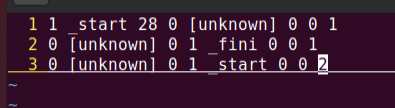
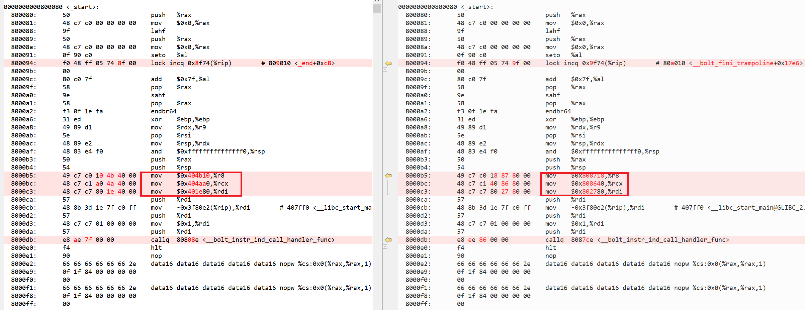

## Relocation Section的必要性分析
Bolt插桩/优化过程中，要求其输入的二进制文件需包含relocation section。而正常编译出的二进制文件，linker 默认不输出这些section。下面就以coremark为例，探索Relocation Section在Bolt中的作用。

以coremark为例，默认编译出的二进制文件是不包含.rela.text section的。编译命令：
```shell
~/project/llvm/build/bin/clang -O2 -Ilinux -Iposix -I. -DFLAGS_STR=\""-O2 -DPERFORMANCE_RUN=1  -lrt"\" -DITERATIONS=0 -DPERFORMANCE_RUN=1 core_list_join.c core_main.c core_matrix.c core_state.c core_util.c posix/core_portme.c -o ./coremark.exe -lrt
```
查看其section `readelf -S coremark.exe` 如下：
```shell
There are 28 section headers, starting at offset 0x82c8:

Section Headers:
  [Nr] Name              Type             Address           Offset
       Size              EntSize          Flags  Link  Info  Align
  [ 0]                   NULL             0000000000000000  00000000
       0000000000000000  0000000000000000           0     0     0
  [ 1] .interp           PROGBITS         00000000004002a8  000002a8
       000000000000001c  0000000000000000   A       0     0     1
  [ 2] .note.ABI-tag     NOTE             00000000004002c4  000002c4
       0000000000000020  0000000000000000   A       0     0     4
  [ 3] .gnu.hash         GNU_HASH         00000000004002e8  000002e8
       000000000000001c  0000000000000000   A       4     0     8
  [ 4] .dynsym           DYNSYM           0000000000400308  00000308
       00000000000000f0  0000000000000018   A       5     1     8
  [ 5] .dynstr           STRTAB           00000000004003f8  000003f8
       0000000000000083  0000000000000000   A       0     0     1
  [ 6] .gnu.version      VERSYM           000000000040047c  0000047c
       0000000000000014  0000000000000002   A       4     0     2
  [ 7] .gnu.version_r    VERNEED          0000000000400490  00000490
       0000000000000030  0000000000000000   A       5     1     8
  [ 8] .rela.dyn         RELA             00000000004004c0  000004c0
       0000000000000030  0000000000000018   A       4     0     8
  [ 9] .rela.plt         RELA             00000000004004f0  000004f0
       00000000000000a8  0000000000000018  AI       4    21     8
  [10] .init             PROGBITS         0000000000401000  00001000
       000000000000001b  0000000000000000  AX       0     0     4
  [11] .plt              PROGBITS         0000000000401020  00001020
       0000000000000080  0000000000000010  AX       0     0     16
  [12] .text             PROGBITS         00000000004010a0  000010a0
       0000000000003a75  0000000000000000  AX       0     0     16
  [13] .fini             PROGBITS         0000000000404b18  00004b18
       000000000000000d  0000000000000000  AX       0     0     4
  [14] .rodata           PROGBITS         0000000000405000  00005000
       0000000000000698  0000000000000000   A       0     0     16
  [15] .eh_frame_hdr     PROGBITS         0000000000405698  00005698
       000000000000017c  0000000000000000   A       0     0     4
  [16] .eh_frame         PROGBITS         0000000000405818  00005818
       0000000000000740  0000000000000000   A       0     0     8
  [17] .init_array       INIT_ARRAY       0000000000407e00  00006e00
       0000000000000008  0000000000000008  WA       0     0     8
  [18] .fini_array       FINI_ARRAY       0000000000407e08  00006e08
       0000000000000008  0000000000000008  WA       0     0     8
  [19] .dynamic          DYNAMIC          0000000000407e10  00006e10
       00000000000001e0  0000000000000010  WA       5     0     8
  [20] .got              PROGBITS         0000000000407ff0  00006ff0
       0000000000000010  0000000000000008  WA       0     0     8
  [21] .got.plt          PROGBITS         0000000000408000  00007000
       0000000000000050  0000000000000008  WA       0     0     8
  [22] .data             PROGBITS         0000000000408050  00007050
       000000000000002c  0000000000000000  WA       0     0     16
  [23] .bss              NOBITS           0000000000408080  0000707c
       0000000000000028  0000000000000000  WA       0     0     8
  [24] .comment          PROGBITS         0000000000000000  0000707c
       0000000000000094  0000000000000001  MS       0     0     1
  [25] .symtab           SYMTAB           0000000000000000  00007110
       0000000000000b70  0000000000000018          26    56     8
  [26] .strtab           STRTAB           0000000000000000  00007c80
       0000000000000552  0000000000000000           0     0     1
  [27] .shstrtab         STRTAB           0000000000000000  000081d2
       00000000000000f0  0000000000000000           0     0     1
Key to Flags:
  W (write), A (alloc), X (execute), M (merge), S (strings), I (info),
  L (link order), O (extra OS processing required), G (group), T (TLS),
  C (compressed), x (unknown), o (OS specific), E (exclude),
  l (large), p (processor specific)
```
这里是不包含.rela.text section的。下面用llvm-bolt对coremark.exe进行插桩。
```shell
~/project/llvm/build/bin/llvm-bolt coremark.exe --instrumentation-file=/home/wzl/project/coremark/perf.fdata  -instrument -o coremark.instr
```
会发现，bolt执行报错了：
```shell
BOLT-INFO: shared object or position-independent executable detected
BOLT-INFO: Target architecture: x86_64
BOLT-INFO: BOLT version: 5ff27fe1ff03d5aeaf8567c97618170f0cef8f58
BOLT-INFO: first alloc address is 0x0
BOLT-INFO: creating new program header table at address 0x200000, offset 0x200000
BOLT-ERROR: instrumentation runtime libraries require relocations
```
修改bolt源码：
```shell
diff --git a/bolt/include/bolt/Core/BinaryContext.h b/bolt/include/bolt/Core/BinaryContext.h
index ccd183369954..eafe0bf74a9c 100644
--- a/bolt/include/bolt/Core/BinaryContext.h
+++ b/bolt/include/bolt/Core/BinaryContext.h
@@ -552,7 +552,7 @@ public:
   std::unique_ptr<MCAsmBackend> MAB;
 
   /// Indicates if relocations are available for usage.
-  bool HasRelocations{false};
+  bool HasRelocations{true};
 
   /// Is the binary always loaded at a fixed address. Shared objects and
   /// position-independent executables (PIEs) are examples of binaries that
diff --git a/bolt/lib/Rewrite/RewriteInstance.cpp b/bolt/lib/Rewrite/RewriteInstance.cpp
index 2d3f987af959..4798456d02fc 100644
--- a/bolt/lib/Rewrite/RewriteInstance.cpp
+++ b/bolt/lib/Rewrite/RewriteInstance.cpp
@@ -1588,7 +1588,7 @@ Error RewriteInstance::readSpecialSections() {
               "Use -update-debug-sections to keep it.\n";
   }
 
-  HasTextRelocations = (bool)BC->getUniqueSectionByName(".rela.text");
+  HasTextRelocations = true; // (bool)BC->getUniqueSectionByName(".rela.text");
   LSDASection = BC->getUniqueSectionByName(".gcc_except_table");
   EHFrameSection = BC->getUniqueSectionByName(".eh_frame");
   GOTPLTSection = BC->getUniqueSectionByName(".got.plt");
```
这里修改的目的是，虽然coremark.exe中没有rela.text section，但是在bolt程序中当做有，看下会导致哪些问题。
再次执行上述的插桩命令，会发现bolt执行完了。接下来，执行coremark.instr。查看perf.fdata，会发现里面基本没有记录。



为了定位数据输出问题，这里做一组对照实验。编译时链接器加--emit-relocs选项。

- 生成带relocaton section的coremark_reloc.exe
  ```
  ~/project/llvm/build/bin/clang -O2 -Wl,--emit-relocs -Ilinux -Iposix -I. -DFLAGS_STR=\""-O2 -DPERFORMANCE_RUN=1  -lrt"\" -DITERATIONS=0 -DPERFORMANCE_RUN=1 core_list_join.c core_main.c core_matrix.c core_state.c core_util.c posix/core_portme.c -o ./coremark_reloc.exe -lrt
  ```
- 对coremark_reloc.exe插桩生成coremark_reloc.instr
  - 注意，这里需要指定数据的保存位置且要用绝对路径，否则可能无法找到perf.fdata文件。
  ```
  ~/project/llvm/build/bin/llvm-bolt coremark_reloc.exe --instrumentation-file=/home/wzl/project/coremark/perf.fdata  -instrument -o coremark_reloc.instr
  ```
- 分别对coremark.instr和coremark_reloc.instr进行反汇编，对比反汇编的结果。
  ```
  objdump -d coremark.instr
  objdump -d coremark_reloc.instr
  ```
对比结果如下：


主要区别是_start函数中有三条立即数的mov指令，而这三个立即数分别对应__libc_csu_fini，__libc_csu_init和main函数的地址。左边是coremar.instr的反汇编，三个立即数分别对应原text section的函数地址，右边是coremark_reloc.instr的反汇编，三个立即数对应新text section中的函数地址。

简单说，coremark.exe中不含rela.text section，对于_start函数中的三条mov指令，bolt没有办法识别这三个立即数是与三个符号绑定的，因此，在函数地址发生变化以后，也就不能做地址更新。而coremark_reloc.exe在插桩过程中，反汇编_start函数时，可以通过rela.text section读取到三条指令分别与三个符号绑定。反汇编过程会将指令的立即数替换为symbol，后面经重新汇编和链接以后三条指令会更新为新的函数地址。

综上，relocation section的主要作用为辅助函数反汇编，因为有些指令，仅从操作码上无法判断其是否有symbol引用。而bolt插桩/优化又可能导致symbol地址发生变化，若反汇编时缺乏symbol引用信息，会影响后面汇编和链接时指令的更新。

**注：**上面的实验使用的clang14进行编译。若使用clang15，则_start中的三条mov指令对应的位置被编译成三条lea，此时coremark即使不包含rela.text section，仍可正常做插桩和优化。原因是lea指令可以通过操作码获知该指令包含symbol引用。

[文中生成的相关文件](https://github.com/zhihaishibei/BlogFile/tree/master/BoltRelocation)